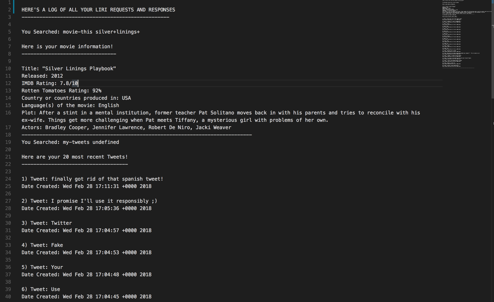

# liri-node-app

Link to github repo: https://github.com/sefeder/liri-node-app

This app utilizes node.js backend code and several different backend packages to create a "Siri-like" assistant that responds to 4 different command line inputs: my-tweets, movie-this, spotify-this-song, and do-what-it-says

### Technology Used:

    node.js
    JavaScript
    npm

### Future Verisions:

Future versions of the app will have more commands that Liri can take such as current-weather based on geocode, and will have an easier-to-read log.txt.